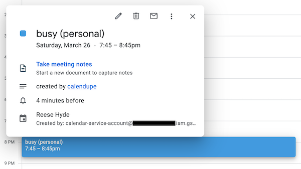

# Calendupe

Calendupe copies obfuscated events from one calendar into another. For example, use it to copy events from a personal 
calendar into a work one.

## Implementation

Calendupe is a GCP-native program that uses the following cloud products:
- Google Calendar API to read and update calendars
- Google Cloud Storage to store calendar synchronization state and implement a global lock
- Google Cloud Functions to deploy a serverless API that listens for calendar updates
- Google Cloud Tasks to schedule resubscription to calendars when the notification channel is close to expiry

## Setup
Follow these instructions to deploy Calendupe.

#### Bucket Setup

You'll need at least one bucket. It's recommended to create a separate bucket for the lock, with a 
[Lifecycle Rule](https://cloud.google.com/storage/docs/managing-lifecycles) to expire objects after 1 day. This 
will ensure that if a function fails to release the lock, it will be cleared by GCS and prevent permanent deadlock.

#### Cloud Tasks Setup

Create a Tasks queue, e.g. `gcloud tasks queues create calendupe-subscribe`

#### Configuration

1. Copy the config example: `cp config_example.py config.py`
2. Populate the correct values

#### Service Account Setup

1. Create a service account with the "Storage Objects Admin" and "Cloud Tasks Enqueuer" roles
2. Download a key for the service account and save it as `service-account.json` in the `calendupe` folder
3. Share your source calendar with the service account email, allowing at least "See all event details"
4. Share your target calendar with the service account email, allowing at least "Make changes to events"

#### Deploying Function

from `calendupe` folder:
`gcloud functions deploy calendupe --runtime python39 --trigger-http --allow-unauthenticated --service-account=<SERVICE_ACCOUNT>`

Note that authentication is handled inside the API by matching the `TOKEN` configuration parameter.

#### Testing Subscription

Ensure `REMAIN_SUBSCRIBED = False` in your latest deployment config. Run `subscribe.py` to subscribe to the calendar 
for slightly over 1 hour, and ensure everything works as expected. Note that you'll need to modify the source 
calendar before an initial sync is made. If you need to unsubscribe, the required resource ID will be printed at 
subscribe time as well as written into the `subscribe_logs` folder.

#### Permanent Deployment

If your test subscription hasn't yet expired, unsubscribe. Update `REMAIN_SUBSCRIBED = True` in your config and 
redeploy the function. Re-run the subscription, unsubscribing before if needed. Check your cloud function logs to 
ensure that it subscribed to the channel and scheduled a successful resubscription shortly after.

#### Disabling

As long as the function is configured with `REMAIN_SUBSCRIBED = True`, it will continue refreshing its subscription by 
scheduling a resubscribe task for shortly before the channel expiry. 
In order to disable calendupe:
1. Ensure the current deployment has `REMAIN_SUBSCRIBED = False`
2. Run the `subscribe.unsubscribe()` method
3. Remove any pending resubscription tasks. This can be done from the Cloud Tasks Console
